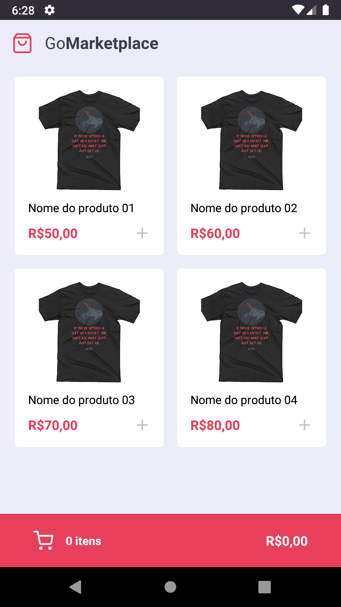
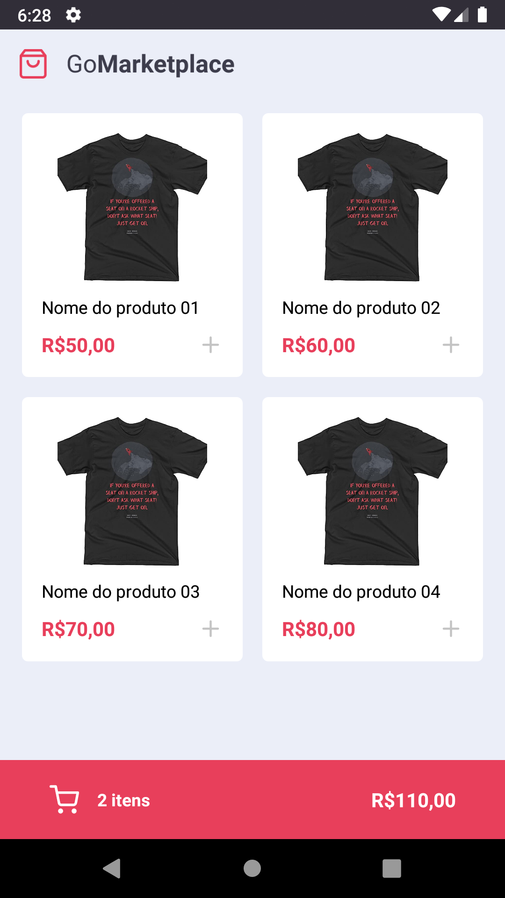
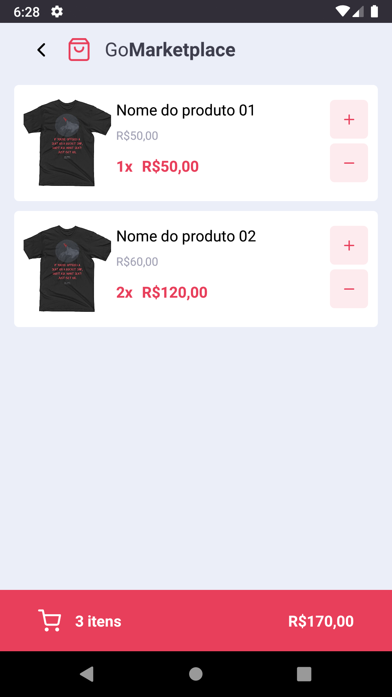
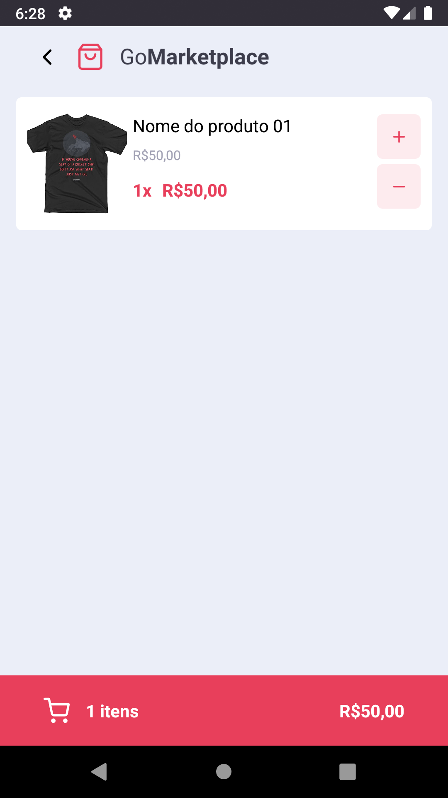

<div align="center">
  <br />
  <p>
    
  </p>
  <br />
  <br />
</div>

## Índice

- [Sobre](#Sobre)
- [Instalação](#Instalação)
- [Utilizando uma fake API](#Utilizando-uma-fake-API)
- [Interface da aplicação](#Interface-da-aplicação)
- [Contato](#Contato)

## Sobre

Aplicativo desenvolvido em [React Native](https://reactnative.dev/) com fake API [json-server](https://www.npmjs.com/package/json-server) para testes das interfaces.

- Object-oriented
- Predictable abstractions
- Performant
- 100% coverage of the Discord API

## Instalação

**Node.js 12.20.0 or newer is required.**

**React Native 4.7.0 or newer is required.**

Para instalação das bibliotecas:

- `yarn install`

Para execução no emulador Android:

- `yarn android`

Para execução no emulador iOs:

- `yarn ios`

Caso o React Native não execute juntamente com a opção do Android ou ios executar o seguinte comando:

- `yarn start`

<br />
<br />

### Utilizando uma fake API

Antes de tudo, para que você tenha os dados para exibir em tela, criamos um arquivo que você poderá utilizar como fake API para te prover esses dados.

Para isso, deixamos instalado no seu package.json uma dependência chamada `json-server`, e um arquivo chamado `server.json` que contém os dados para uma rota `/products`. Para executar esse servidor você pode executar o seguinte comando:

```js
  yarn json-server server.json -p 3333
```

<br />
<br />

## Interface da aplicação

<p>A imagem abaixo mostra a interface inicial do app:</p>

<br />
<br />
<br />
<p>Aqui vemos a atualização da quantidade de itens no carrinho e o valor calculado do carrinho:</p>


<br />
<br />
<br />
<p>A imagem abaixo mostra a interface do carrinho de compras do app:</p>


<br />
<br />
<br />
<p>Nestas ultimas imagens mostramos a interação com os itens do carrinho de compras</p>


<br />


<br />
<br />

## Contato

Caso queira entrar em contato comigo poderá enviar um email para arthur.nemi.g@gmail.com.
